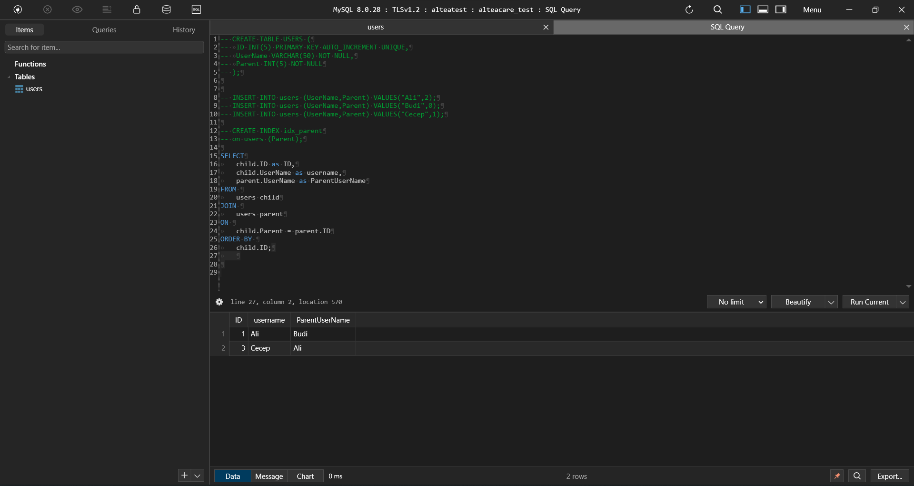

### QUERY TO CREATE TABLE FROM CASE STUDY
	CREATE TABLE USERS (
		ID INT(5) PRIMARY KEY AUTO_INCREMENT UNIQUE,
		UserName VARCHAR(50) NOT NULL UNIQUE,
		Parent INT(5) NOT NULL
	);

### QUERY TO INSERT VALUE TO TABLE BASED ON CASE STUDY
	INSERT INTO users (UserName,Parent) VALUES("Ali",2);
	INSERT INTO users (UserName,Parent) VALUES("Budi",0);
	INSERT INTO users (UserName,Parent) VALUES("Cecep",1);

### QUERY TO GET RESULT EXPECTED FROM CASE STUDY  
	SELECT
		child.ID as ID,
		child.UserName as username,
		parent.UserName as ParentUserName
	FROM users child
	JOIN users parent
		ON child.Parent = parent.ID
	ORDER BY child.ID;

### RESULT FROM ABOVE QUERY, try executing above query in database manager query tab

	 ID | UserName | ParentUserName
	 1  | Ali      |  Budi 
	 3  | Cecep    |  Ali

### DECISION ON WHICH COLUMN TO BE INDEXED

 BASED ON BEST PRACTICE GUIDELINE FROM ORACLE ON CHOOSING THE RIGHT TABLE TO CREATE INDEX:

	- if you frequently want to retrieve less than about 15% of the rows in a large table.
	- Index columns that are used for joins to improve join performance.
	- Primary and unique keys automatically have indexes,`

 Some columns are strong candidates for indexing. Columns with one or more of the following characteristics are good candidates for indexing:

	- Values are unique in the column, or there are few duplicates.
    - There is a wide range of values (good for regular indexes).
    - There is a small range of values (good for bitmap indexes).
	- The column contains many nulls, but queries often select all rows having a value.

BASED ON THE ABOVE GUIDLINE AND CATEGORY

   ID : 
   `is primary key, therefore no need to create index anymore for this column`

   UserName: 

  	is good candidate to be indexed since it
		- has unique value
		- frequently retrieved in the query
		- There is a wide range of values 
	but the column don't have a null value or empty value to meet 4th category of column to index

  Parent :
	 	
	is a great column candidate to create an index, since it has 
		- have unique value or have few duplication
		- have null or 0 value to it 
		- not a primary key
		- required frequent retrieve from the query as the table size grow

### INDEX FOR users.Parent column

``CREATE INDEX idx_parent
on users (Parent);``

### TEST RESULT

